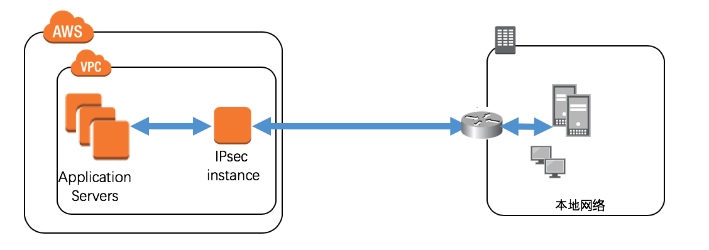
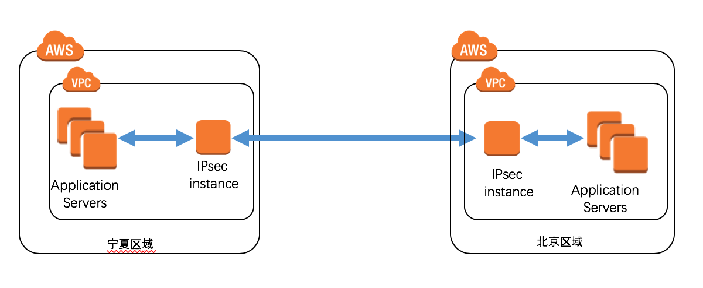
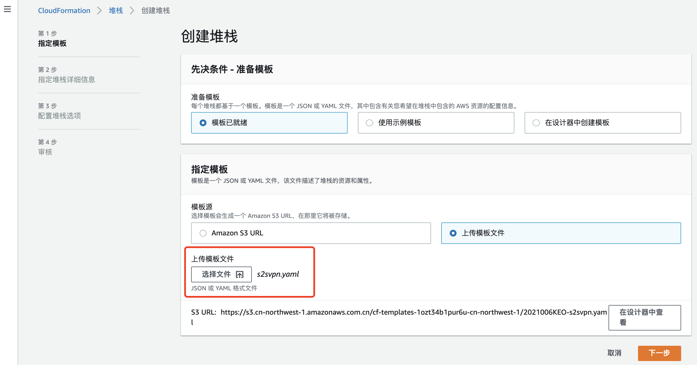
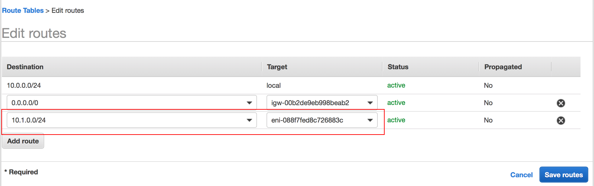

# IPSecVPN

1. AWS和本地私有网络建立互通
2. AWS中国区域vpc之间建立互通

## 免责说明
建议测试过程中使用此方案，生产环境使用请自行考虑评估。 
当您对方案需要进一步的沟通和反馈后，可以联系 taodai@nwcdcloud.cn 获得更进一步的支持。 
欢迎联系参与方案共建和提交方案需求, 也欢迎在 github 项目issue中留言反馈bugs。

## 项目说明
1. 适用于AWS中国区域与您的本地私有网络通过IpsecVPN互通场景。此场景要求您的本地办公网络具有支持ipsecvpn功能的路由器或网关。

2. 适用于您在aws中国区域内有多个VPC，两个vpc之间需要互相访问的场景。

 

## 准备工作
需要提前准备好实例的EIP和私有IP。其中，私有IP将在模板中作为参数填入， EIP将在实例创建后进行绑定。

 1. 在AWS CloudFormation控制台中启动模板
 

参数说明

参数名称  | 参数含义  | 取值
--------  | -------- | -----
InstanceType | 实例类型 | 下拉选择：t2.micro(测试使用),c5.large(正式使用)
KeyName | EC2登陆密钥对名称 | 下拉选择
LeftIp | 本端IP |  文本框：本端公网地址
LeftSubnet | 本端VPC网段地址 | 文本框: 地址网段
PSK | PreSharedKey | 文本框：字符串
RightIP | 对端IP | 文本框: 对端公网地址
RightSubnet | 对端网段地址 | 文本框: 地址网段
SubnetId   | EC2所属子网 | 下拉选择
VpcId  | EC2所属VPC  | 下拉选择       

 2. 将EIP绑定给EC2, 并将本端网段地址、EIP告知给对端路由器配置人员做配置。

 3. 修改路由表信息，添加到对端网段的路由。 
    （注：此处以修改VPC路由表为例）

    

 4. 对端路由器配置人员完成后，进行连通性验证。

## FAQ

  - 问：我需要更改IKE两个阶段的协商参数怎么办？    
    本模板为简洁起见，固化了协商参数。如需更改，请自行修改s2svpn.yaml文件。具体参数设置可参看man ipsec.conf

## 参考
-  man ipsec.conf
